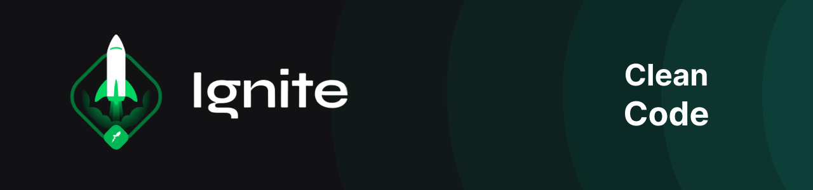

  

 

<h1 align="center">
  Ignite

   

  Clean Code (aulas)
</h1>

 

  
  
  
  

## Índice

### Chapter I
  - [Fundamentos do Clean Code](01-fundamentos)

### Chapter II
  - [Código limpo com JavaScript](02-codigo-limpo-javascript)
  - [Desafio: nomeação de variáveis](05-desafios/01-nomeacao-variaveis)
  - [Desafio: booleanos](05-desafios/02-booleanos)
  - [Desafio: causa/efeito](05-desafios/03-causa-efeito)
